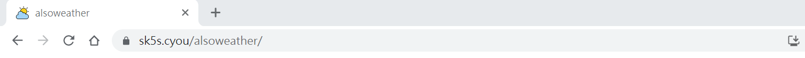
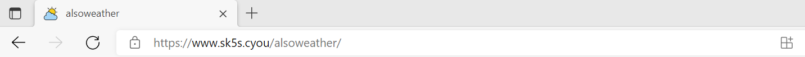
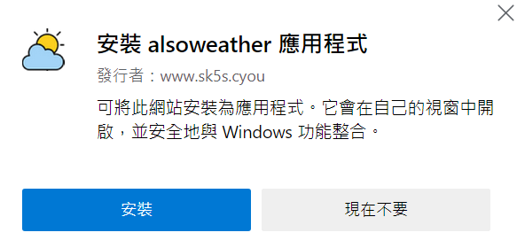
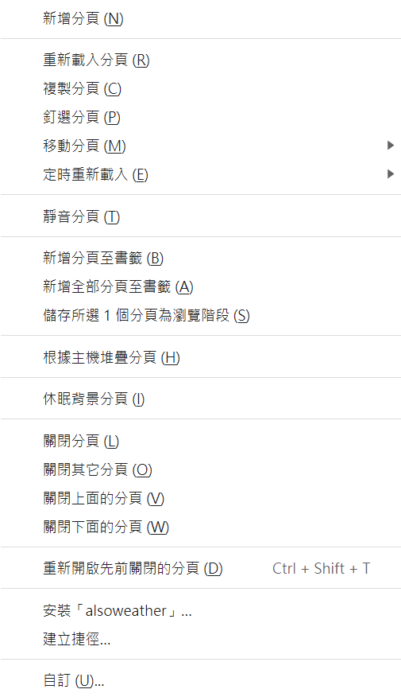
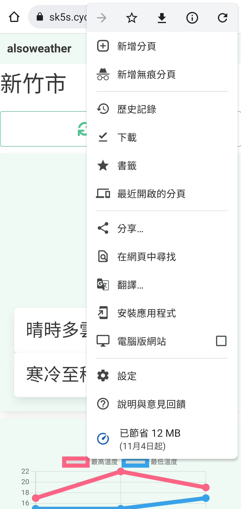
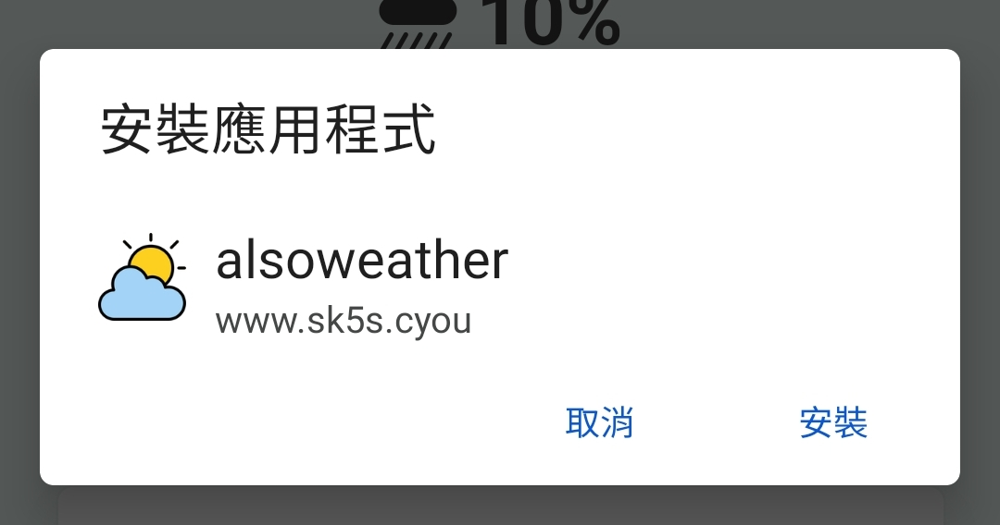
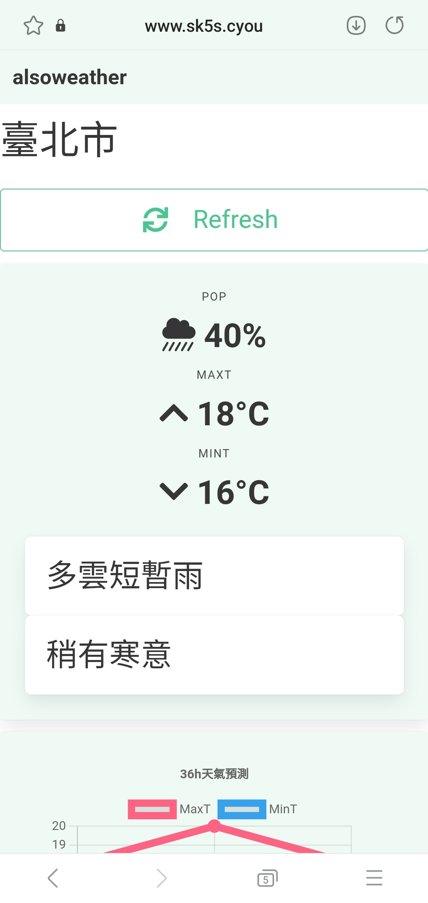
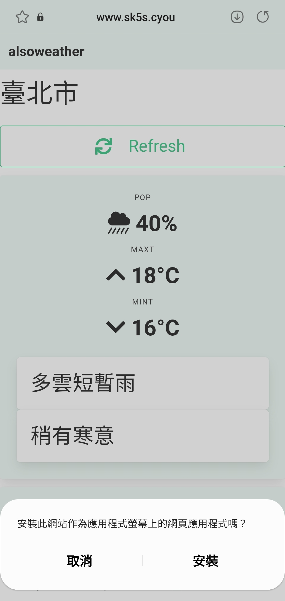
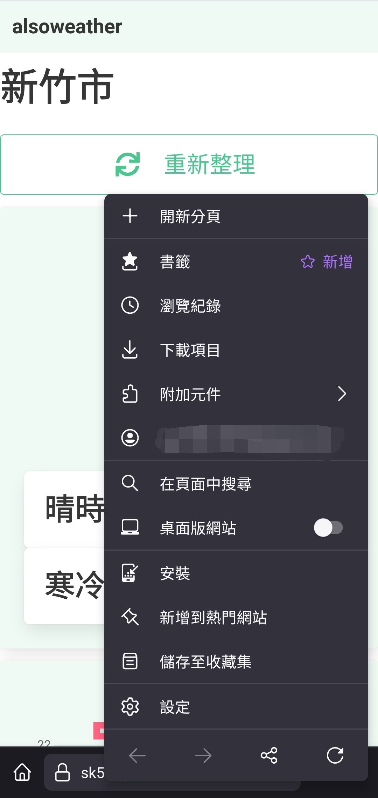

# 安裝漸進式網頁應用程式 Install Progressive Web Apps

## 電腦安裝
### chrome瀏覽器 :id=chrome-desktop
- 打開chrome
- 到[https://sk5s.cyou/alsoweather/](https://sk5s.cyou/alsoweather/)
- 點擊網址列的安裝圖標

- 安裝

### edge瀏覽器 - 推薦
- 打開edge
- 到[https://sk5s.cyou/alsoweather/](https://sk5s.cyou/alsoweather/)
- 點擊網址列的安裝圖標

- 安裝

### firefox瀏覽器
> 不支援

### brave瀏覽器
> 同[chrome 瀏覽器](#chrome-desktop)

### vivaldi瀏覽器
- 打開vivaldi
- 到[https://sk5s.cyou/alsoweather/](https://sk5s.cyou/alsoweather/)
- 在alsoweather的分頁上點擊右鍵

- 點擊 安裝「alsoweather」

## 手機安裝
### chrome瀏覽器 - 推薦 :id=chrome-mobile
- 打開chrome
- 到[https://sk5s.cyou/alsoweather/](https://sk5s.cyou/alsoweather/)
- 點擊功能表的加到主畫面圖標

- 安裝

### 三星瀏覽器
- 打開網際網路
- 到[https://sk5s.cyou/alsoweather/](https://sk5s.cyou/alsoweather/)
- 點擊網址列的安裝圖標

- 安裝

### duckduckgo app
> 不支援

### firefox瀏覽器
- 打開網際網路
- 到[https://sk5s.cyou/alsoweather/](https://sk5s.cyou/alsoweather/)
- 點擊網址列的安裝圖標

### vivaldi瀏覽器
> 同[chrome瀏覽器 - 推薦](#chrome-mobile)
